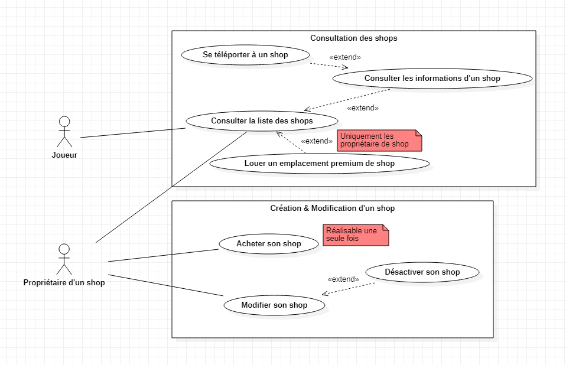

# Spécification fonctionnelles et non-fonctionnelles

Auteur : Voltariuss (chef de projet et développeur)

## Introduction

Dans un contexte de re-lancement du serveur Minecraft "Diagonia", le besoin de proposer un système de shop dans lequel
les joueurs doivent être en mesure de les gérer de façon autonome se fait ressentir. 

Il s'agira également de mettre en place une interface graphique simple, ergonomique et efficace.

### Cadre et limitations

L'objectif du produit final est double :

* Mettre en place un système de gestion de shops de manière autonome pour les joueurs (achat et configuration)
* Mettre à disposition des joueurs finaux du serveur une interface graphique intégrée au jeu Minecraft **sans
  utilisation de mods** (donc aucune modification du client).

### Les interfaces graphiques dans Minecraft

Les interfaces graphiques évoquées correspondent en réalité à des inventaires d'objets en jeu avec des propriétés
particulières : la tentative de récupération d'un item par un simple click peut être annulée et entraîner l'exécution d'
actions prédéterminées par exemple. Par ce détournement de la fonctionnalité des inventaires de Minecraft, il est
possible de réaliser des actions au clic, afficher des informations à l'utilisateur ou des réalisations plus complexes
comme un système de stockage virtuel d'items. Les saisies clavier utilisateurs correspondent à un cas spécifique dans ce
contexte : il peut être nécessaire de fermer l'inventaire pour demander une saisie à travers le chat du joueur ou bien
en simulant le placement d'un panneau dans lequel l'utilisateur peut saisir des données.

Il est clair que cette approche souffre de limitations : réaliser des inventaires complexes peut vite devenir un réel
défi en plus d'être dans certains cas coûteux à mettre en place. Également, il est impossible d'y retrouver tout le
confort d'une réelle interface graphique. Pour surmonter ces limites, il faudrait opter pour une approche de
développement incluant la modification du client (jeu lancé par l'utilisateur sur son ordinateur). Ce n'est pas le cas
pour ce plugin.

### Environnement d'exécution

Le programme développé devra pouvoir être lancé par un serveur Minecraft, serveur fourni par Mojang gratuitement. Le
serveur Minecraft ne pouvant être modifié sans inspections avancées du code source et/ou l'utilisation de librairies
conçus pour cet usage (comme les Mixins), il est fréquent d'opter pour une surcouche au serveur proposant toute une API
permettant la modification du comportement du serveur. Dans le cadre de ce projet, Bukkit est la surcouche utilisée. En
réalité, il s'agit de PaperMC qui est utilisé aujourd'hui, une surcouche de la surcouche Bukkit (inception like).
Ce serveur embarque toute l'API de Bukkit tout en offrant des outils supplémentaires et des optimisations améliorant
les performances générales du serveur.

## Spécifications fonctionnelles

### Cas d'usage

Les fonctionnalités suivantes doivent être possibles pour les joueurs :

* Consulter la liste des shops existants
* Consulter les détails d'un shop existant (nom du propriétaire, liste des métiers exercés par le propriétaire, etc)
* Se téléporter à un shop
* Acheter son propre shop
* Modifier son shop
* Désactiver son shop

Ci-dessous le diagramme des cas d'utilisation :  

### Hypothèses

* Un joueur est en mesure d'écrire plus de 150 caractères pour un message dans le chat

### Règles métier

* Les coordonnées d'un bloc correspondent à un triplet (x, y, z) dont les valeurs sont flottantes
* Un joueur doit être identifié par son UUID et non par son pseudo

### Besoins fonctionnels

#### Création d'un shop

* Le joueur doit pouvoir acheter son shop
* L'achat d'un shop n'est possible qu'une seule fois
* Le coût d'achat d'un shop d'élève à 20 000 gonia

#### Modification d'un shop

* Le joueur doit pouvoir modifier l'item représentatif du shop :
  * En le remplaçant par sa tête
  * En spécifiant l'ID d'un item
  * En demandant l'utilisation de l'item de sa main
* Par défaut, l'item de représentation d'un shop doit correspondre à la tête du propriétaire
* Le joueur doit pouvoir modifier la description du shop
* La description d'un shop ne doit pas exercer 150 caractères
* Le joueur doit pouvoir désactiver/réactiver son shop
* Un avertissement doit être affiché au joueur pour lui demander sa confirmation lors de la tentative de désactivation
d'un shop
* Si le joueur maintient son intention de désactiver son shop malgré l'avertissement, alors le shop devient inactif
* Lorsque le joueur tente de désactiver son shop :
  * Un premier avertissement doit être affiché au joueur pour lui demander sa confirmation
  * Un deuxième avertissement doit s'afficher si son shop occupe actuellement un emplacement premium pour lui indiquer
  les conséquences de l'action, à savoir l'annulation de la location prématurément et de manière irréversible
* Le joueur doit pouvoir modifier le point de téléportation selon trois méthodes :
  * Indiquer au programme d'utiliser sa position courante (solution la plus user-friendly)
  * Spécifier les coordonnées du bloc cible en x, y, z et un point cardinal pour la direction du regard du joueur
téléporté (nord, nord-est, est, sud-est, sud, sud-ouest, ouest, nord-ouest, nord).
  * Spécifier les coordonnées du bloc cible en x, y et z et la direction avec les valeurs pitch et yaw (version la plus
  avancée)
* Le point de téléportation de shop ne peut être placée uniquement dans la ville dont fait partie le propriétaire du
  shop
  * Si le joueur quitte sa ville, son shop se désactive et le point de téléportation se supprime
* Il doit être possible de définir un point de téléportation pour le shop d'un joueur habitant d'une
  ville non-officielle

#### Consulter un shop

* Pour un shop donné, le joueur doit pouvoir consulter :
  * Le nom du propriétaire
  * L'item représentatif
  * La description
  * Les métiers exercés par le propriétaire
  * Le niveau de chaque métier exercé par le propriétaire
  * Le nom de la ville officielle occupée par le propriétaire
* Le nom du shop doit suivre le format suivant : `Shop de X` où X correspond au pseudo du joueur propriétaire du shop
* Si un shop n'a aucune description spécifiée, alors il faudra afficher "aucune description spécifiée"

#### Consulter la liste des shops

* Le joueur doit pouvoir consulter la liste de tous les shops
* Le joueur doit pouvoir filtrer la liste en fonction des métiers exercés (mineur, bûcheron, forgeron, ...)
* La liste doit pouvoir être triée par :
  * Nom du propriétaire par ordre alphabétique croissant
  * Nom du propriétaire par ordre alphabétique décroissant
  * Niveau total des métiers exercés par les propriétaires par ordre croissant
  * Niveau total des métiers exercés par les propriétaires par ordre décroissant
* Jusqu'à trois shops au maximum peuvent être mis en évidence
* Si au moins un emplacement premium est disponible, un propriétaire de shop doit pouvoir le louer
* Le prix de location du shop est de 10 000 gonia
* La location d'un emplacement premium pour shop doit durer 3 jours exactement, passé ce délai l'emplacement premium
redevient disponible
* Seuls les shops activés doivent pouvoir être visibles dans la liste
* Si la quantité de shops excède les capacités d'affichage de l'interface graphique, alors il faudra pouvoir naviguer
à travers des pages

#### Se téléporter à un shop

* Le joueur doit pouvoir se téléporter à un shop activé
* Le joueur ne doit pas pouvoir se téléporter à un shop désactivé
* La téléportation n'est possible uniquement si la zone de destination est accessible, c'est-à-dire :
  * Le bloc du dessous de la zone de téléportation est solide
  * Les deux blocs au-dessus correspondent à des blocs non solides (air, plaque de pression, etc)

#### Inactivité

* Un shop est automatiquement désactivé si le propriétaire est inactif depuis au moins 30 jours
* Lors de la connexion d'un joueur ayant été identifié comme inactif, s'il est propriétaire d'un shop alors
un message lui sera envoyé pour lui indiquer de l'action entreprise durant son absence concernant la désactivation
de son shop

#### Configuration

Certaines valeurs du programme doivent pouvoir être paramétrables :
* Le coût d'achat d'un shop par un joueur
* Le nombre maximum de caractères dans la description d'un shop
* Le délai d'inactivité d'un joueur avant la désactivation de son shop
* La durée de location d'un emplacement premium de shop
* Le coût de location d'un emplacement premium de shop
* Tous les messages envoyés par le plugin

### Interfaces externes

#### Vault

Le plugin Vault propose une API pour la gestion des permissions, de l'économie et du chat sans avoir à dépendre
directement des plugins implémentant ces systèmes. Aujourd'hui, il s'agit du API incontournable dès lorsque l'on parle
de développement Bukkit.

Cette interface permettra donc de réalisation des transactions monétaires durant l'achat d'un shop par exemple.

Lien : https://github.com/MilkBowl/VaultAPI

#### Jobs Rebord

Plugin permettant d'implémenter les métiers sur le serveur, son utilisation sera nécessaire afin de récupérer des
informations sur les joueurs concernant les métiers exercés et leur niveau.

Lien : https://github.com/Zrips/Jobs

#### Lands

Lands est le plugin en charge de la gestion des villes sur le serveur. Il sera nécessaire de communiquer avec l'API
du plugin pour y récupérer des informations sur les villes comme leur nom, les habitants, etc.

Lien : https://github.com/Angeschossen/LandsAPI

## Spécifications non-fonctionnelles

### Technologies utilisées

La création de ce programme se déroulera à l'aide du langage de programmation `Java` accompagné du gestionnaire de
dépendances et de build `Maven`. L'outil `google-java-format` sera utilisé comme formatteur du code Java écrit pour
améliorer la lisibilité de celui-ci.  
`SonarQube` sera également utilisé comme analyseur de code afin de détecter d'éventuels bugs, les mauvaises pratiques,
les risques de sécurité ou encore pour pouvoir évaluer facilement la couverture de code suivant les données collectées
par le programme `JaCoCo`. Pour les tests, `JUnit 5` sera utilisé pour l'écriture des tests unitaires et d'
intégration. `Mockito` aura quant à lui pour rôle de permettre la mise en place du mécanisme de "Mockage", mécanisme
nécessaire dans le contexte de développement d'un plugin Bukkit.  
`Guice` permettra la mise en place du pattern de conception d'inversion de contrôle à travers l'injection de
dépendances. Ce pattern permet d'améliorer l'organisation, la lisibilité et la maintenabilité/évolutivité du code ainsi
produit.  
`Hybernate` assure de son côté l'implémentation d'un ORM afin de faciliter la formulation de requête SQL avec la base de
données du programme pour peu d'efforts.  
`SLF4J` sera utilisé comme API de logging accompagné de l'implémentation `Log4j`. Le programme sera compatible pour une
utilisation avec `MariaDB`.

### Critère qualité (norme ISO 9126)

Les critères de qualité présentés par la norme ISO 9126 permettent d'évaluer la qualité d'un système informatique à
travers un ensemble de critères.

En raison des coûts bien trop importants pour réaliser un logiciel répondant à toutes les exigences de la norme et de
l'absence d'intérêt de certains critères, seules les suivants seront pris en compte dans le cadre du développement
de l'application :
* Capacité fonctionnelle : est-ce que le logiciel répond aux besoins fonctionnels ?
* Fiabilité : capacité à maintenir son niveau de service au cours du temps, peu importe les conditions
* Utilisabilité / Facilité d'utilisation : est-ce que le logiciel requiert peu d'efforts pour être utilisé ?
* Rendement et efficacité
* Maintenabilité : capacité à ajouter du fonctionnel ou corriger des bugs aisément
  * Une trace d'exécution doit être présente durant l'exécution du plugin
  * Un mode debug doit permettre de visualiser le flux de données et l'enchaînement des actions plus précisément

Ici la portabilité n'est pas prise en compte puisque le programme doit opérer uniquement en tant que plugin Bukkit.

### Critères d'ergonomie

Les critères d'ergonomie des interfaces graphiques cités dans cette section proviennent d'une liste établie par des
professionnels du domaine et communément adopté dans la communauté du développement logiciel. Plus d'informations sur
ces critères peuvent être retrouvés dans le compte rendu des travaux de recherche menés par J. M. Christian Bastien et
Dominique L. Scapin de l'INRIA sur l'établissement de ces critères. Le document est
accessible [ici](https://www.usabilis.com/wp-content/uploads/2017/09/Criteres-Ergonomiques-pour-l-Evaluation-d-Interfaces-Utilisateur-Scapin-Bastien.pdf)
.

#### Guidage

Le guidage de l'utilisateur lors de son interaction avec l'interface graphique est primordiale pour en faciliter son
apprentissage et son utilisation.

##### Incitation

L'interface graphique étant au service de l'utilisateur la manipulant, l'ajout d'incitations durant l'accomplissement
d'une tâche est nécessaire puisque la plus-value apportée peut être considérable. Cela est particulièrement vrai
pour de nouveaux utilisateurs peu-expérimentés. Dans le contexte du projet Diagonia, cela est encore plus pertinent
puisque la cible inclut des enfants potentiellement en bas âge ou encore des personnes peu expérimentées avec l'usage
de l'informatique.

L'incitation au sein d'une interface graphique consiste à accompagner l'utilisateur sur la tâche qu'il doit réaliser
en donnant des indices sur les actions attendues, l'état exact du système ou encore 

Cela peut passer par :
* La spécification d'un titre pertinent pour chaque fenêtre
* Un bon nommage de chaque bouton, suivi d'une description si nécessaire
* Un ou plusieurs exemples pour réaliser l'action souhaitée par l'utilisateur

##### Feedback

Aspect primordial dans la conception d'une interface graphique, le feedback permet à l'utilisateur de connaître du
système à tout moment lors de son interaction avec le système. Cela passe par :
* Le déclenchement d'une erreur quand quelque chose ne s'est pas déroulé correctement
* L'ajout d'un spinner ou concept similaire pour indiquer que le système est en train de travailler en arrière-plan
et que l'utilisateur doit attendre. L'idéal étant d'accompagner cette illustration d'attente par l'indication des
étapes suivies par le système en arrière, la mise en place d'une barre de progression ou quelque chose de similaire.
C'est particulièrement efficace lorsque le système rencontre une erreur qui ne remonte pas à l'utilisateur afin que
celui-ci puisse identifier facilement quand interrompre le processus actuellement suivi pour éventuellement le relancer,
le signaler aux développeurs ou autre.
* L'ajout d'un timeout côté système lors des phases de calculs : il est inutile de faire attendre l'utilisateur
plusieurs minutes alors que le système est supposé répondre en quelques secondes tout au plus.

#### Adaptabilité

L'interface doit s'adapter au contexte de l'utilisateur. Dans le cadre de l'application, cela peut passer par la mise à
disposition d'un bouton d'achat d'un shop pour les joueurs sans shop tandis que les propriétaires auront à la place un
bouton d'édition de celui-ci. Il n'est ni pertinent d'offrir la possibilité d'éditer un shop qu'un utilisateur ne
possède pas encore tout comme celle d'acheter un shop pour un joueur qui en possède déjà un.

L'élaboration de l'interface graphique sera également réalisée en proposant plusieurs moyens d'accomplissement d'une
tâche donnée. Cela peut passer notamment par la mise à disposition de commandes comme alternative à l'interface
graphique ou encore la proposition de plusieurs moyens de navigation au sein de l'interface graphique notamment avec la
mise à disposition de raccourcis (/shop pour accéder directement au menu des shops sans avoir à passer par le menu
principal préalablement).

#### Gestion des erreurs

Un point d'honneur sera accordé dans la gestion des erreurs :

* Protection contre les erreurs : des mécanismes seront présents pour réduire le risque que l'utilisateur fournisse des
  informations invalides comme la demande de confirmation si les conséquences d'une action peuvent être importantes.
* Qualité des messages d'erreur : quand une erreur survient, un feedback doit être réalisé avec un message expliquant
  que l'action souhaitée n'a pas pu être réalisé, les raisons de cette erreur et des moyens pour l'utilisateur de
  corriger sa saisie. Les messages devront par ailleurs être brefs et adopter un ton neutre
  (pas de blâme, ni d'humour).
* Correction des erreurs : l'utilisateur ne doit pas être pénalisé en cas de saisie incorrecte ou l'être le moins
  possible.
